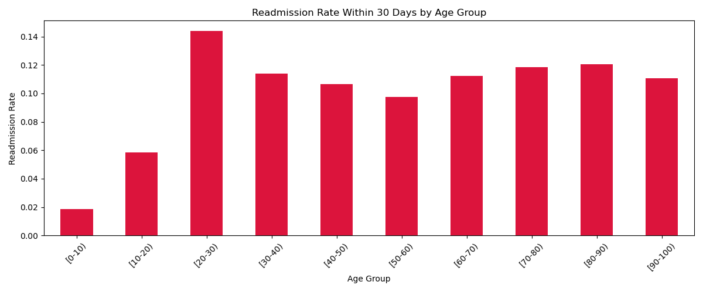
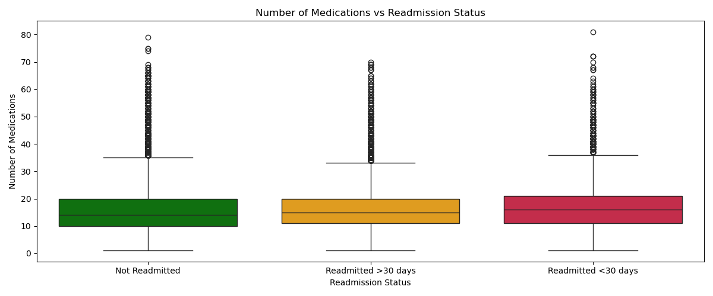
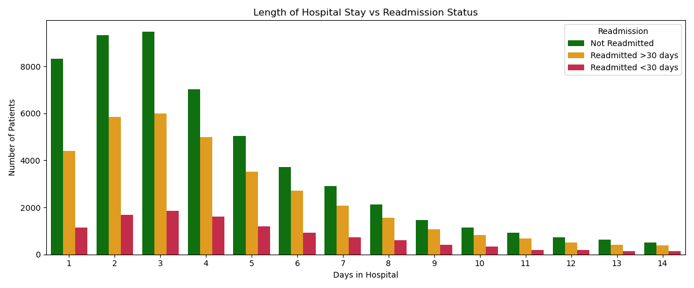
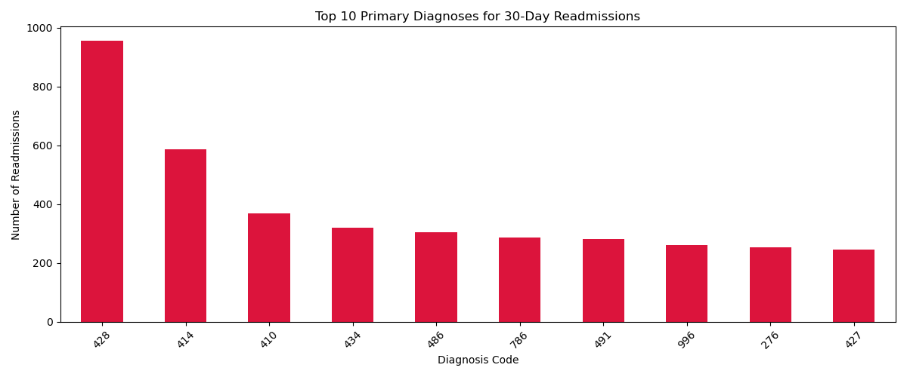

# Healthcare Patient Readmission Analysis 🏥

## Business Problem
Hospitals face heavy financial penalties for patients readmitted within 30 days of discharge. This analysis identifies which patient profiles are at highest risk — giving hospitals a data-backed way to prioritize follow-up care.

## Tools Used
- Python, Pandas, Matplotlib, Seaborn
- Jupyter Notebook

## Key Findings
- Patients aged **20-30** have the highest 30-day readmission rate at **14%**
- **Heart Failure (Code 428)** is the #1 diagnosis linked to readmission
- Patients with **more medications** have significantly higher readmission risk
- Short hospital stays of **2-3 days** are misleading — many of these patients return within 30 days

## Business Recommendation
Hospitals should flag high-risk patients before discharge — specifically heart failure patients aged 20-30 with high medication counts and short stays — and assign them mandatory follow-up care within 7 days.

## Charts

